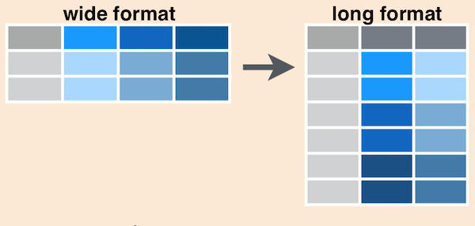

```{r setup, include=FALSE}
library(psychRstats)
library(learnr)
library(tidyverse)
library(gradethis)
library(flair)

tutorial_options(exercise.timelimit = 200, exercise.checker = gradethis::grade_learnr)
knitr::opts_chunk$set(error = TRUE)

# data
fisher <- structure(list(id = c("P003", "P004", "P006", "P007", "P009",
  "P012", "P013", "P014", "P019", "P023", "P040", "P048", "P068", "P072",
  "P074", "P075", "P100", "P111", "P115", "P117", "P127", "P139", "P160",
  "P163", "P169", "P202", "P203", "P206", "P219", "P220", "P223", "P244"),
  hrsd.pre = c(16, 16, 13, 11, 17, 9, 14, 10, 10, 8, 21, 14, 11, 15, 12, 18, 7,
  18, 18, 12, 9, 14, 13, 16, 13, 10, 18, 11, 21, 14, 21, 12), hrsd.post = c(3,
  7, 8, 3, 7, 0, 3, 3, 5, 1, 8, 6, 6, 6, 8, 11, 2, 11, 8, 9, 4, 9, 6, 10, 9, 4,
  5, 2, 5, 10, 3, 3), hars.pre = c(15, 33, 13, 17, 9, 13, 19, 12, 10, 7, 41, 17,
  14, 13, 10, 23, 14, 15, 19, 18, 13, 12, 11, 16, 15, 11, 20, 16, 27, 13, 12,
  8), hars.post = c(4, 13, 6, 4, 11, 1, 6, 6, 3, 2, 9, 8, 12, 4, 11, 18, 1, 8,
  8, 7, 5, 9, 3, 5, 3, 7, 10, 4, 9, 9, 2, 3), num.sessions = c(9, 12, 11, 14,
  12, 8, 10, 9, 7, 10, 13, 11, 9, 8, 10, 8, 4, 13, 9, 8, 12, 14, 13, 14, 12, 12,
  10, 9, 10, 12, 9, 10)), row.names = c(NA, -32L), class = c("tbl_df", "tbl",
  "data.frame"))
fisherplot <- fisher %>%
  pivot_longer(cols = c(hrsd.pre, hrsd.post),
               names_to = "time", values_to = "hrsd") %>%
  group_by(time) %>%
  summarize(mean = mean(hrsd),
            sd = sd(hrsd),
            n = n(), 
            sem = sd/sqrt(n),
            .groups = "drop_last")
#friends %>% select(shootingdrills, expectedoutcome_3) %>% na.omit() %>% dput()
voting <- structure(list(shootingdrills = c(1, 1, 2, 1, 1, 1, 1, 1, 1, 1, 1, 1, 1, 1, 1,
  1, 2, 1, 2, 1, 1, 1, 1, 1, 1, 1, 1, 2, 1, 1, 1, 2, 1, 1, 1, 1, 1, 1, 1, 1, 1,
  2, 2, 1, 1, 1, 1, 1, 1, 1, 1, 2, 1, 1, 1, 1, 1, 1, 1, 1, 1, 2, 2, 1, 1, 1, 2,
  1, 1, 1, 2), expectedoutcome_3 = c(80, 45, 53, 30, 70, 30, 50, 50, 50, 50, 50,
  90, 55, 55, 0, 35, 70, 50, 80, 89, 80, 50, 64, 40, 70, 85, 65, 66, 55, 50, 40,
  63, 57, 39, 55, 13, 65, 50, 73, 96, 89, 57, 66, 40, 40, 60, 80, 60, 50, 25,
  65, 63, 50, 63, 55, 39, 60, 56, 80, 50, 50, 70, 53, 50, 50, 79, 60, 49, 68,
  75, 50)), row.names = c(NA, -71L), class = c("tbl_df", "tbl", "data.frame"))
```

## Introduction

Today's lab's objectives are to:

* Learn about dependent-samples *t*-tests
* Learn how to conduct independent- and dependent-samples *t*-tests in R
* Visualize the results of such a test

## Dependent means *t*-tests
###
In a dependent means *t*-test, otherwise-known-as the *t*-test for dependent means or paired-samples *t*-test, we are comparing two means that are dependent on one another in some way. The scores are related to one another in a way that's relatively easy to see---usually, e.g., because it's the same person who's doing something at two time-points. 

As with the **independent-samples** *t*-test, the population's mean and variance are unknown, and so must be estimated. 

###

In the dependent-samples *t*-test, we **can** calculate difference scores with individuals because there is an obvious individual to subtract from---themself---and so we can easily do so. Rather than needing to use a distribution of the differences between means, we can use a single comparison distribution based on those difference scores. 

Read about dependent-samples *t*-tests and then return here to this tutorial.

#### Quiz

```{r quiz, echo=FALSE}
quiz(
  question("Which is the comparison distribution for the *t*-test for dependent means?",
    answer("The *z* distribution with a mean of 0 and *SD* of 1"),
    answer("The *t* distribution with a mean of 0 and *SD* of 1"),
    answer("The *t* distribution with a mean of 0 and *SD* of *S*"),
    answer("The *t* distribution with a mean of 0 and *SD* of $S_M$", correct = TRUE),
    random_answer_order = TRUE, allow_retry = TRUE
  ),
  question(
    "Why is the *df* in a *t*-test for dependent means equal to *n*-1?",
    answer("Because the paired samples mean that there's fewer room for variation", correct = TRUE),
    answer("Because the paired samples have more variance"),
    answer("Because the test relies on Welch's *t* rather than Student's"),
    answer("Because X and Y are separate"),
    random_answer_order = TRUE, allow_retry = TRUE
    ),
  question(
    "Which of the following is the formula for *t* in the *t*-test for dependent means?",
    answer("$t=\\frac{M-\\mu}{S_M}$", correct = TRUE),
    answer("$t=\\frac{M_1-M_2}{S_{difference}}$"),
    answer("$t=\\frac{SS}{df}$"),
    answer("$t=\\frac{S}{\\sqrt{n}}$"),
    random_answer_order = TRUE, allow_retry = TRUE,
    correct = "Yes, exactly---it's the same formula as for the one-sample *t*-test",
    incorrect = "Not quite... it's a subtraction in the numerator, but focused on a difference for the $\\mu$ (the population mean) of 0..."
    ),
  caption = "Review the lecture on the *t*-test for dependent means"
)
```

### Key ideas

So, the major takeaways here are:

1. The dependent-samples *t*-test is based on the difference scores, but those difference scores are calculated within paired participants---and therefore the comparison distribution is the sample of those difference scores
2. Therefore, this test has $df=n-1$, like the one-sample *t*-test/
3. The comparison distribution in the dependent-samples *t*-test is a *t* distribution with a mean of 0, $df=n-1$, and a standard deviation based on the distribution of difference scores ($S_M=\frac{S}{\sqrt{n}}$)
4. The cutoff for the sample is based on those degrees of freedom, e.g., `qt(c(.025, .975), df = 4)`.
5. The equation for *t* has not substantially changed: $t=\frac{M-\mu}{S_M}$---and in face, $\mu$ in the dependent-samples *t*-test is **_always_** actually equal to 0, because we are **_always_** testing whether there is a substantial change from 0. 

### 

I've suggested that it's quite easy to identify whether a test should require a *t*-test for dependent means, or not---because the test obviously includes paired samples. Let's give it a try. For each of the following, select which kind of test is best.

```{r quiz2, echo=FALSE}
quiz(
  question(
    "You know that the average person tells 4 lies per day.  You have a sample of 83 participants and want to compare whether they tell more lies than the average person.",
    answer("*z*-test for a single score"),
    answer("*t*-test for a single sample", correct = TRUE),
    answer("*t*-test for independent means"),
    answer("*t*-test for dependent means"),
    allow_retry = TRUE, 
    correct = "Yes, this is a *t*-test for a single sample, because we know something about the 'average' person, and want to compare a sample to them.",
    incorrect = "Not quite. Consider this: do we know something about the population?"
  ),
  question(
    "A researcher measures how often a group of people lie to their significant others, and then compares that rate to how often the same sample of people lies to acquaintances.",
    answer("*z*-test for a single score"),
    answer("*t*-test for a single sample"),
    answer("*t*-test for independent means"),
    answer("*t*-test for dependent means", correct = TRUE),
    allow_retry = TRUE, 
    correct = "Yes, this is a *t*-test for dependent means, because we have people who are being measured **twice**, but no other data.",
    incorrect = "Not quite. Consider this: how often are our participants being tested?"
  ),
  question(
    "A researcher is comparing whether adolescents or adults lie more often.",
    answer("*z*-test for a single score"),
    answer("*t*-test for a single sample"),
    answer("*t*-test for independent means", correct = TRUE),
    answer("*t*-test for dependent means"),
    allow_retry = TRUE, 
    correct = "Yes, this is a *t*-test for independent means. We know nothing about the population, and have two samples we want to compare.",
    incorrect = "That isn't quite right... Consider this: do we know something about the population? And how many samples are we planning to measure?"
  ),
  question(
    "You want to compare whether one particular individual lies more or less often than the general population.",
    answer("*z*-test for a single score", correct = TRUE),
    answer("*t*-test for a single sample"),
    answer("*t*-test for independent means"),
    answer("*t*-test for dependent means"),
    allow_retry = TRUE, 
    correct = "Yes, this is a *z*-test for a single score, because we have a single person's score, and are comparing them to the whole population.",
    incorrect = "Not quite. Consider this: do we have a sample here? "
  ),
  question(
    "A research is interested in whether monozygotic ('identical') twins have the same level of neuroticism at the age of four.",
    answer("*z*-test for a single score"),
    answer("*t*-test for a single sample"),
    answer("*t*-test for independent means"),
    answer("*t*-test for dependent means", correct = TRUE),
    allow_retry = TRUE, 
    correct = "Yes, this is a *t*-test for dependent means. The samples are paired (each twin with its sibling) and therefore the test is paired.",
    incorrect = "That isn't quite right... Consider this: is there a connection between twins?"
  ),
  caption = "Which test is right?"
)
```


## First test

Today we'll be using data from a study from 2019, Fisher et al. (2019) ([link to article](https://psyarxiv.com/8ezhm)). The data from Fisher and colleagues was a test of a type of therapy they had developed; read more at the link. For all participants, the researchers collected Hamilton Rating Scale for Depression (HRSD) and Hamilton Anxiety Rating Scale (HARS) before and after treatment. Let's take a look:

```{r}
fisher
```

We should create columns of difference scores (for post-treatment minus pre-treatment scores), for both the HARS and HRSD. 

We could do that manually, like so:

```{r}
fisher$hrsd.post - fisher$hrsd.pre
fisher$hars.post - fisher$hars.pre
```

As you can likely imagine, subtracting the pre (before) scores from the post (after scores) gives us a negative score when scores have gone down (from pre to post) and a positive score when scores have gone up. 

We can **save** these scores into the data frame by assigning them to a new named column, e.g., 

```{r, eval=FALSE}
fisher$hrsd.diff <- fisher$hrsd.post - fisher$hrsd.pre
fisher$hars.diff <- fisher$hars.post - fisher$hars.pre
```

We can also use a new function from the {dplyr} package called `mutate()`. `mutate()` is much like the `summarize()` function we used in the past two lab: you can create multiple new variables through it all at once, and it works well with the chain (`%>%`). For example, this would create squares of all `hrsd.post` scores:

```{r}
fisher %>%
  mutate(hrsd.squared = hrsd.post^2)
```

The difference, of course, is that rather than `summarize()`ing your data, `mutate()`... well, it mutates it. If you mutate a pre-existing variable, it changes; if you create a new one, it adds it, as you see above.

You give it a try: using `mutate()`, create `hrsd.diff` and `hars.diff` as post-pre scores for HRSD and HARS scores, as above. (Here, be sure **not** to name the data frame after you begin the chain with it, though.)

```{r mutate, exercise=TRUE}
fisher %>%
  mutate()
```

```{r mutate-hint-1}
fisher %>%
  mutate(hrsd.diff = ...,
         hars.diff = ...)
```

```{r mutate-solution}
fisher %>%
  mutate(hrsd.diff = hrsd.post - hrsd.pre,
         hars.diff = hars.post - hars.pre)
```

```{r mutate-check, echo=FALSE}
grade_code()
```

###

Okay, so let's presume you've gone ahead and saved those back into the data-frame, by running something like this:

```{r preparediff}
fisher <- fisher %>%
  mutate(hrsd.diff = hrsd.post - hrsd.pre,
         hars.diff = hars.post - hars.pre)
```

```{r}
fisher <- fisher %>%
  mutate(hrsd.diff = hrsd.post - hrsd.pre,
         hars.diff = hars.post - hars.pre)
```

Now, let's use it for our *t*-test! The questions we could ask with a *t*-test are these: Did participants improve on depression? What about on anxiety? 

We'll start by doing this by hand (i.e., using the formulas you've learned), and then get into doing it with the `t.test()` function. 

### Step 1: Restate question as a research and null hypothesis

```{r quiz3, echo=FALSE}
quiz(
  question(
    "Which of the following best describes the null hypothesis?",
    answer("There is no difference between the means for participants before treatment and after treatment, $\\mu_{difference}=0$", correct = TRUE),
    answer("The participants will be doing worse after treatment, $\\mu_{post}<\\mu_{pre}$"),
    answer("There is no difference between the variances for the participants before treatment and after treatment, $\\sigma_{difference}=0$"),
    answer("The participants will be doing better after treatment, $\\mu_{post}>\\mu_{pre}$"),
    random_answer_order = TRUE, 
    allow_retry = TRUE, 
    correct = "Yes, exactly, the null hypothesis is that there is no difference before and after treatment.",
    incorrect = "Not quite... remember, the null hypothesis suggests that there is no effect, right?"
  ),
  question(
    "Which correctly describes the research hypothesis?",
    answer("There is a significant difference between the means for participants before treatment and after treatment, $\\mu_{difference}\\neq0$", correct = TRUE),
    answer("The mean for participants before treatment is more than the mean for participants after treatment, $\\mu_{before}>\\mu_{after}$"),
    answer("The mean for participants before treatment is less than or equal to the mean for participants after treatment, $\\mu_{before}\\leq\\mu_{after}$"),
    answer("There is no difference between the means for participants before treatment and after treatment, $\\mu_{difference}=0$"),
    random_answer_order = TRUE, 
    allow_retry = TRUE, 
    correct = "Exactly! The research hypothesis is that the means are different---and thus that the difference scores are **not** 0.",
    incorrect = "Not quite---remember, the research hypothesis is about there being a difference between the means, but is not directional."
  ),
  caption = "Restating the research question"
)
```

### Step 2: Determine the characteristics of the comparison distribution

For the difference scores between pre- and post- HRSD scores, we need to make use of those `hrsd.diff` scores, `fisher$hrsd.diff`: we can calculate the sum of squares, to start.

Deviations:

```{r}
fisher$hrsd.diff - mean(fisher$hrsd.diff)
```

Squared deviations:

```{r}
(fisher$hrsd.diff - mean(fisher$hrsd.diff))^2
```

_Summation_ of squared deviations, $SS=\sum{(X-M)^2}$

```{r}
ss <- sum((fisher$hrsd.diff - mean(fisher$hrsd.diff))^2)
ss
```

We can also calculate the degrees of freedom (the number of rows is the *n*):

```{r}
n <- nrow(fisher)
df <- n - 1
df
```

With these, then, we calculate the variance, $S^2$, which is just $S^2=\frac{SS}{df}$:

```{r variancedef}
variance <- ss / df
variance
```

How do you get the standard deviation from that? It's the square root.

Try it yourself using the `sqrt()` function, and assign it to a variable called `s`:

```{r get_s, exercise=TRUE}

```

```{r get_s-solution}
s <- sqrt(variance)
```

```{r, echo=FALSE}
s <- sqrt(variance)
```

###

Lastly, we need the $S_M$, the standard deviation for the comparison *t* distribution. Recall that $S_M=\frac{S}{\sqrt{n}}$... we have `s` and `n`, so you can calculate that! Go ahead and do it, calling the resulting variable `s.m`

```{r s_m, exercise=TRUE}

```

```{r s_m-solution}
s.m <- s / sqrt(n)
```

```{r s_m-check, echo=FALSE}
grade_code()
```

```{r, echo=FALSE}
s.m <- s / sqrt(n)
```

###

Okay, so what **does** the *t* distribution look like for this comparison? Like this:

```{r, echo=FALSE}
ggplot(data = data.frame(x = c(-5, 5)), aes(x = x)) +
  stat_function(fun = dt, args = list(df = 31), color = "dark blue", size = 1.5) +
  scale_x_continuous(limits = c(-5, 5)) +
  theme_minimal() +
  labs(x = "", y = "") + 
  scale_y_continuous(breaks = NULL) +
  theme(panel.grid.minor = element_blank(), 
        panel.grid.major = element_blank(), 
        panel.border = element_blank(), 
        axis.title = element_text(size = 24),
        axis.text = element_text(size = 20))
```

It's almost normal---although not **quite**---and it has 31 degrees of freedom, a mean of 0, and a standard deviation of `s.m`, which here is approximately `r round(s.m, 2)`.

### Step 3: Determine the sample cutoff score

This hasn't changed from last time we discussed it, not in R---you'll use the `qt()` function:

```{r}
qt(c(.025, .975), df = 31)
```

So yes, it's $\pm2.04$, which is indeed not quite normal---still *t*, though.

### Step 4: Determine the sample's [t] score

Well, we've got all the pieces that go into the *t* equation:

$$t=\frac{M-\mu}{S_M}$$

Go ahead and run the code below.

```{r findt, exercise=TRUE, exercise.setup = "preparediff"}
t <- (mean(fisher$hrsd.diff) - 0) / s.m
t
```

### Step 5: Determine whether to reject the null

That's quite a large value for *t*. Your eye can probably tell you that it's big enough. But, formally: is it larger than 2.04 or smaller than -2.04? Yes, of course! 

## Do it with a function
###
So, the great thing about R is that we very rarely need to calculate things like this step-by-step. Instead, you can use the `t.test()` function. You might recall that I said that the *t*-test for dependent means is essentially the *t*-test for a single sample whose population mean is 0, if you find the difference scores. Well, we **do** have the difference scores, here: `fisher$hrsd.diff`.

And the formula for using a `t.test()` like that is:

```
t.test(dataframe$differencescores, mu = 0)
```

Try it yourself, replacing the dummy text (`dataframe` and `differencescores`) with the names of the current data frame and column of interest:

```{r singlesampledependent, exercise=TRUE, exercise.setup = "preparediff"}

```

```{r singlesampledependent-solution}
t.test(fisher$hrsd.diff, mu = 0)
```

```{r singlesampledependent-check, echo=FALSE}
grade_code()
```

###

Actually, you don't even technically need the `mu = 0` piece---if you just provide a set of scores, R will assume you're testing against `mu = 0`. Better to be explicit, though. But just for example:

```{r}

```

Most of the time, we don't actually want to calculate the difference scores, and the `t.test()` function can deal with that, too... if you look at the `help(t.test)` page, it will tell you that it takes an `x` and, optionally, a `y`. We could run it on the `hrsd.post` and `hrsd.pre` scores from the `fisher` data frame! Give it a try. You can explicitly write `t.test(x = ..., y = ...)` (replacing the ellipses with the columns in the format of `DATAFRAME$COLUMN1, DATAFRAME$COLUMN2`), or just list them one after the other, with a comma.

```{r ttestxy, exercise=TRUE}

```

```{r ttestxy-solution}
t.test(fisher$hrsd.post, fisher$hrsd.pre)
```

```{r ttestxy-check, echo=FALSE}
grade_code()
```

### 

If you look carefully, you'll see that the values don't match, though. That's because we haven't told R that these are **paired**. We can do that by adding the argument `paired = TRUE`. Run this and see that it **is** actually the same as the "one-sample" version.

```{r pairs, exercise=TRUE}
t.test(fisher$hrsd.post, fisher$hrsd.pre, paired = TRUE)
```

All right! We've got this down into one line.

### Graph it!

So we can see that there's an effect---it's statistically significant. But can we see what that looks like? Let's do it in two ways. First: just plot the pre-scores against the post-scores. I'll give you the structure for the {*ggplot2*} code and list the variables we care about, below. You finish the plot.

* The `data` is `fisher` still
* The `x` is either `hrsd.pre` or `hrsd.post`; the `y` is the other

```{r finishplot, exercise=TRUE}
ggplot(data = , aes(x = , y = )) +
  geom_point() +
  theme_bw()
```

```{r finishplot-solution}
ggplot(fisher, aes(x = hrsd.pre, y = hrsd.post)) +
   geom_point() +
   theme_bw()
```

```{r finishplot-check, echo=FALSE}
grade_code()
```

###

Your plot looked something like this:

```{r}
ggplot(fisher, aes(x = hrsd.pre, y = hrsd.post)) +
   geom_point() +
   theme_bw() +
   labs(x = "Pre-Treatment HRSD Scores", y = "Post-Treatment HRSD Scores", 
        title = "Comparing Pre- and Post-Treatment HRSD Scores")
```

That looks about right---there's a general sense in which if the pre-treatment score was high, so was the post-treatment score, right? You'll notice that the y-axis has values that are much lower, however. Ultimately, this plot might not be very interesting---or what we care about. We've been saying we care about **means**. Well, we learned how to calculate means in the last labs, and how to do it per group. 

"How do you use the `group_by()` function per column?" you might ask. Well, unfortunately, you can't. 

This gives me the opportunity to introduce you to one more exciting pair of functions: `pivot_longer()` and its twin sibling, `pivot_wider()`.

Think of them as doing this:



They're literally taking the things in multiple, related columns, and then combining them into **two** columns: one repeating the column *names*, and the other presenting their contents. Let's look at a quick, toy example:

```{r}
# create the data -- imagine four friends went apple-picking
apples <- data.frame(
  collector = c("Jocelyn", "Sally", "Kendra", "Royce"),
  Cortlands = c(4, 2, 0, 0),
  Jonagolds = c(0, 4, 5, 6),
  PinkLadys = c(3, 8, 3, 4)
)
# print it out
apples
```

But imagine we wanted to summarize not how many apples each **person** collected, but how many apples of each *kind* were collected? Well, `pivot_longer()` will help us out.

```{r}
apples %>%
  pivot_longer(cols = c(Cortlands, Jonagolds, PinkLadys))
```
### 

Now, the columns have more or less what we'd want---who collected the apples, which apple was which, and then the `value`: how many were collected. `pivot_longer()` takes an argument (`cols = ...`) which is the columns you want to include---here, we gave it three with the `c()` combine function. We can also tell it `names_to` and `values_to`---meaning that it would replace `name` and `value` in the table above:

```{r}
apples %>%
  pivot_longer(cols = c(Cortlands, Jonagolds, PinkLadys),
               names_to = "apple", values_to = "number") # they're in quotes because they're names---
# but then they'll be columns in the output, so we don't need quotation marks again
```

Okay, and with that, we can now use `group_by()` and `summarize()`:

```{r}
apples %>%
  pivot_longer(cols = c(Cortlands, Jonagolds, PinkLadys),
               names_to = "apple", values_to = "number") %>%
  group_by(apple) %>%
  summarize(howmany = sum(number))
```

Okay! Now we know how many apples were picked. Let's try applying that to the fisher data. 

###

First, use `pivot_longer()` to combine the columns `hrsd.pre` and `hrsd.post`. Set the `names_to` equal to `"time"` and the `values_to` to `"hrsd"`. 

```{r pivotlonger, exercise=TRUE}
fisher %>%
  pivot_longer(cols = ...,
               names_to = "", values_to = "")
```

```{r pivotlonger-solution}
fisher %>%
  pivot_longer(cols = c(hrsd.pre, hrsd.post),
               names_to = "time", values_to = "hrsd")
```

```{r pivotlonger-check, echo=FALSE}
grade_code()
```

###

Now, take the code below and add on another chain with a `%>%` and `group_by()` `time`, before using `summarize()` to get the mean, *sd*, *n*, and *sem* for the `hrsd` scores. (You can use those names for them. Remember that *n* is just the `n()` function.)

```{r summarizehrsd, exercise=TRUE}
fisher %>%
  pivot_longer(cols = c(hrsd.pre, hrsd.post),
               names_to = "time", values_to = "hrsd")
```

```{r summarizehrsd-solution}
fisher %>%
  pivot_longer(cols = c(hrsd.pre, hrsd.post),
               names_to = "time", values_to = "hrsd") %>%
  group_by(time) %>%
  summarize(mean = mean(hrsd),
            sd = sd(hrsd),
            n = n(), 
            sem = sd/sqrt(n))
```

```{r summarizehrsd-check, echo=FALSE}
grade_code()
```

###

I've taken the liberty of saving that whole thing into a variable called `fisherplot`---by assigning it to that name with the `<-` operator. 

You go ahead an plot it, below. Here are some specs:

1. It's a `ggplot()`. The data is `fisherplot` as I just said. 
2. The `aes()` should include `time` as the `x` and `mean` as the `y`. (Time is **almost always** on the x-axis.)
3. You should then add `+` on a `geom_col()`
4. ... and a `theme_minimal()`
5. Then add on a `geom_errorbar()`. The `aes()` inside its parentheses should have `ymin = mean - sem` and `ymax = mean + sem`, as we've been doing.
6. Finally, add on some `labs()`, with `x = "Time assessed"` and `y = "Mean HRSD score"`

```{r plothrsd, exercise=TRUE}

```

```{r plothrsd-solution}
ggplot(fisherplot, aes(x = time, y = mean)) +
  geom_col() +
  theme_minimal() +
  geom_errorbar(aes(ymin = mean - sem, ymax = mean + sem)) +
  labs(x = "Time assessed", y = "Mean HRSD score")
```

```{r plothrsd-check}

```

The error bars won't overlap. That's because (as we already know) there's a significant difference here. Does this plot help you see it? 

## Independent-samples *t*-tests
###
We're not going to learn how to calculate these in the step-by-step way---that's in the homework, if you really want to. (It's okay to be glad about that!)

But we will learn to do them with the `t.test()` function.

Let's look at the `shootingdrills` variable from what was previously the *friends* data frame: Did your high school have mass shooting drills? a 1 = yes, 2 = no. We can compare it to the numeric response asking respondents to predict whether Republicans will control the senate, `expectedoutcome_3`, where a 0 equals "definitely not" and a 100 is "100%". 

We'll have two groups here---those who had shooting drills and those who did not. But they're not paired, so it's an **independent**-samples *t*-test. 

First, we recode `shootingdrills`---it's in a data frame for the purposes of this called `voting`. You've used the `factor()` function before, which takes a variable that's not **really** numeric but has numbers (like this one, which is a list of 1s and 2s) and gives them labels:

```{r}
voting$shootingdrills <- factor(voting$shootingdrills, 
                                levels = c(1, 2),
                                labels = c("Yes", "No"))
```

Now we want to ask this: are those who have shooting drills more likely to think Republicans will continue to control the senate? Well, take a look at the data:

```{r}
voting
```

You might be tempted to run the following:

```{r, eval=FALSE}
t.test(voting$shootingdrills, voting$expectedoutcome_3)
```

But it actually won't work! Instead, we should use a formula. 

This is, fortunately, quite easy. Rather than providing an `x` and `y` to the `t.test()` function, we provide it a formula of the model `y ~ x`, which you can read aloud as "y predicted by x". So we're saying: can we predict this numeric response y by a categorical response x? Assuming x has two levels (like this yes/no question), that'll work splendidly:

```{r}
t.test(voting$expectedoutcome_3 ~ voting$shootingdrills)
```

Weirdly, there's a bit of an effect here (although not statistically-significant at $p < .05$), although it's probably driven by the fact that there are only `r voting %>% filter(shootingdrills == "No") %>% count() %>% pull()` respondents who did **not** have shooting drills, while `r voting %>% filter(shootingdrills == "Yes") %>% count() %>% pull()` did. 

Regardless: that's the *t*-test for independent means in R! 

## Wrap up

Okay! That's it for today. We know how to use the `t.test()` function now for dependent means and independent means. Try out the exercises. 